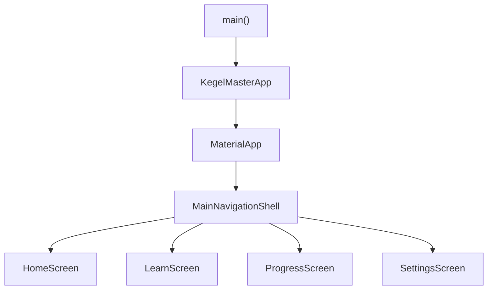

# Architecture

This document describes how **Kegel Master** is structured today: entry points, shell navigation, feature layout, and sensible conventions for extending it.

## Overview

The app boots in `main()`, constructs `KegelMasterApp`, and uses `MaterialApp` with `MainNavigationShell` as the root `home` widget.

| Layer | Responsibility |
|--------|----------------|
| `lib/main.dart` | `runApp(const KegelMasterApp())` |
| `lib/app.dart` | `MaterialApp`, title, theme, `home: MainNavigationShell` |
| `lib/features/shell/` | Bottom navigation and tab body hosting |

## Navigation

[`lib/features/shell/main_navigation_shell.dart`](../lib/features/shell/main_navigation_shell.dart) implements a **four-tab** shell:

1. **Home** — `HomeScreen`
2. **Learn** — `LearnScreen`
3. **Progress** — `ProgressScreen`
4. **Settings** — `SettingsScreen`

The body is an **`IndexedStack`** keyed by the selected tab index, with a Material 3 **`NavigationBar`**. Each child page stays in the tree when not visible, so **widget state is preserved** when switching tabs (unlike replacing the route with a new page each time).

## Feature map

Screens live under `lib/features/<feature>/presentation/`. Current roles (mostly placeholders):

| Feature | Screen | Role today |
|---------|--------|------------|
| `home` | `home_screen.dart` | Placeholder: “Start or resume your session — coming soon.” |
| `learn` | `learn_screen.dart` | Placeholder: guides and techniques — coming soon. |
| `progress` | `progress_screen.dart` | Placeholder list: progress and achievements — coming soon. |
| `settings` | `settings_screen.dart` | Placeholder: preferences — coming soon. |
| `shell` | `main_navigation_shell.dart` | Hosts tabs and shared navigation chrome. |

## Conventions

- **Feature-first layout**: `lib/features/<feature_name>/presentation/` for UI tied to that feature.
- **State today**: plain `StatelessWidget` / `StatefulWidget`; no global state package is required yet.
- **Growing the app**: add shared widgets under something like `lib/widgets/` or `lib/core/` when multiple features need the same UI. Introduce repositories or services under `lib/features/<feature>/data/` (or a shared `lib/data/`) when you add persistence or APIs. Pick a state approach (e.g. Riverpod, Bloc) when cross-tab or async flows need a clear home—no need to commit in this skeleton phase.

## Startup flow (diagram)

