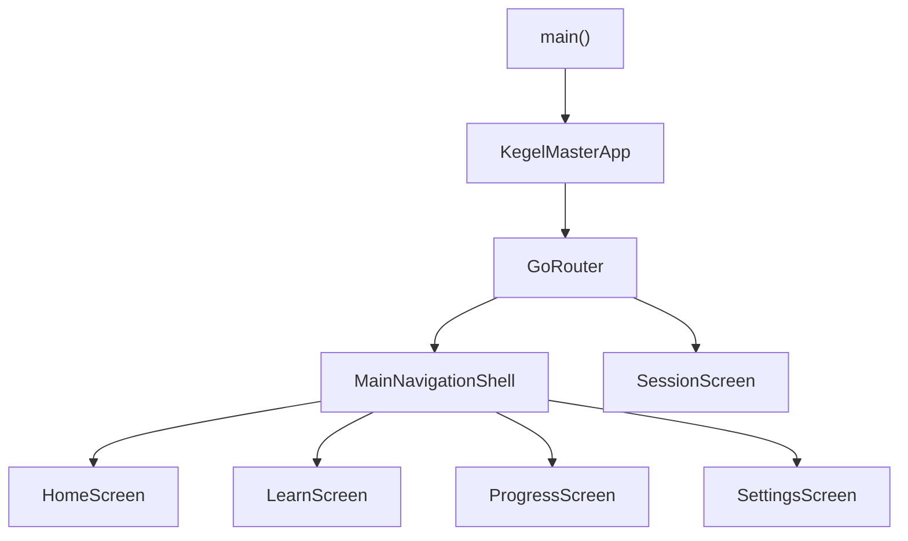

# Architecture

This document describes how **Kegel Master** is structured today: entry points, shell navigation, feature layout, and sensible conventions for extending it.

## Overview

The app boots in `main()`, constructs `KegelMasterApp`, and uses **`MaterialApp.router`** with a **`GoRouter`** defined in [`lib/router/app_router.dart`](../lib/router/app_router.dart). The bottom tab chrome lives in **`MainNavigationShell`**, which hosts the active branch via **`StatefulNavigationShell`**.

| Layer | Responsibility |
|--------|----------------|
| `lib/main.dart` | `runApp(const KegelMasterApp())` |
| `lib/app.dart` | `MaterialApp.router`, title, theme, `routerConfig` |
| `lib/router/` | `GoRouter`: shell tab paths, full-screen **`/session`**, `/` → `/home` redirect, `errorBuilder` |
| `lib/features/shell/` | Bottom navigation and shell scaffold around branch content |

## Navigation

[`lib/router/app_router.dart`](../lib/router/app_router.dart) defines a single **`GoRouter`** with **`initialLocation: /home`**, a top-level **`redirect`** that sends **`/`** to **`/home`**, and an **`errorBuilder`** for unknown paths (minimal “not found” UI and a control that calls **`context.go('/home')`**). A sibling route **`/session`** sits next to the **`StatefulShellRoute`**: it is **not** inside the shell, so the session UI is full-screen without the bottom **`NavigationBar`**.

[`lib/features/shell/main_navigation_shell.dart`](../lib/features/shell/main_navigation_shell.dart) hosts a Material 3 **`NavigationBar`** and a **`StatefulShellRoute.indexedStack`** branch body via **`StatefulNavigationShell`**. Tab changes call **`shell.goBranch(index)`** so the selected tab stays aligned with the active route (deep links, notification opens, and similar mobile entry points later). Indexed-stack semantics (off-tab routes stay mounted) are provided by **`StatefulShellRoute.indexedStack`**, not a hand-rolled **`IndexedStack`**.

| Path | Tab index | Screen |
|------|-----------|--------|
| `/home` | 0 | `HomeScreen` |
| `/learn` | 1 | `LearnScreen` |
| `/progress` | 2 | `ProgressScreen` |
| `/settings` | 3 | `SettingsScreen` |
| `/session` | — (outside shell) | `SessionScreen` |

Home starts a session with **`context.push('/session')`**, which stacks the full-screen route above the shell. **`router.go('/session')`** (or an equivalent deep link) also lands on **`SessionScreen`** without shell chrome.

**State restoration:** OS-level restoration is optional for the first milestone; if it becomes a requirement, add a documented **`restorationScopeId`** on the router or shell per `go_router` / Flutter docs for the SDK version in use.

## Feature map

Screens live under `lib/features/<feature>/presentation/`. Current roles (mostly placeholders):

| Feature | Screen | Role today |
|---------|--------|------------|
| `home` | `home_screen.dart` | Entry copy and **Start session** CTA; navigates to **`/session`**. |
| `learn` | `learn_screen.dart` | Placeholder: guides and techniques — coming soon. |
| `progress` | `progress_screen.dart` | Placeholder list: progress and achievements — coming soon. |
| `settings` | `settings_screen.dart` | Placeholder: preferences — coming soon. |
| `session` | `session_screen.dart` | Guided session flow (full-screen route). |
| `shell` | `main_navigation_shell.dart` | Hosts tabs and shared navigation chrome. |

## Conventions

- **Feature-first layout**: `lib/features/<feature_name>/presentation/` for UI tied to that feature.
- **State today**: plain `StatelessWidget` / `StatefulWidget`; no global state package is required yet.
- **Growing the app**: add shared widgets under something like `lib/widgets/` or `lib/core/` when multiple features need the same UI. Introduce repositories or services under `lib/features/<feature>/data/` (or a shared `lib/data/`) when you add persistence or APIs. Pick a state approach (e.g. Riverpod, Bloc) when cross-tab or async flows need a clear home—no need to commit in this skeleton phase.

## Startup flow (diagram)

## Local notifications and snooze

Daily reminders are scheduled in [`lib/core/services/notification_service.dart`](../lib/core/services/notification_service.dart). Per weekday uses notification ids **11–17**; a one-off **snooze** uses id **99** (one hour later).

- **Snooze action** (`snooze_action`): On Android the action uses `showsUserInterface: false` and `cancelNotification: true` so snooze runs without opening the app and the tray entry is cleared. That path requires `com.dexterous.flutterlocalnotifications.ActionBroadcastReceiver` in [`android/app/src/main/AndroidManifest.xml`](../android/app/src/main/AndroidManifest.xml) (see flutter_local_notifications setup). On iOS the category action is a plain (non-foreground) action for the same behavior. When the app is not in the foreground UI, `notificationTapBackground` can run on a background isolate and calls the same scheduling helper as the foreground path.
- **After snooze:** Cancelling the firing weekday alarm can drop that slot until weekly alarms are rebuilt. [`lib/app.dart`](../lib/app.dart) refreshes `scheduleDailyReminder` on startup and again when the app lifecycle returns to **resumed**, so weekly reminders are restored without requiring a cold start.
- **Swipe dismiss:** Dismissing a notification from the system shade does **not** schedule a follow-up snooze; only the in-notification **Snooze (1 hour)** action does.
